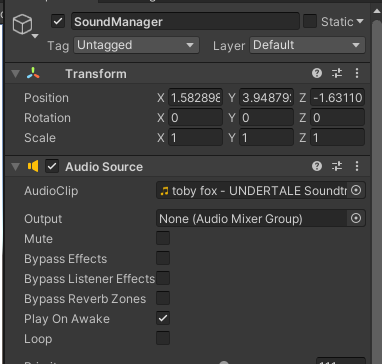

# Small Gimmick Game

# 타이틀 및 게임오버, 클리어 화면

|연번|오브젝트 이름|오브젝트 이미지|
|:---:|:---:|:---:|
|1|타이틀||
|2|게임클리어||
|3|게임오버||
### 1. 타이틀 : 첫 게임 스타트 시 호출되는 Scene입니다. 기능으로는 Ball, Bingo, Pizza 3개의 버튼으로 각 Scene을 호출하여 보내줍니다.
### 2. 게임 클리어, 오버 : 각 Scene이 호출 될 시에 해당하는 사운드가 호출되며 Menu버튼으로 타이틀로 이동합니다.

|오디오|사운드|
|:---:|:---:|
|||

#

  

# 구슬 넣기

|연번|오브젝트 이름|오브젝트 이미지|
|:---:|:---:|:---:|
|1|플레이어||
|2|공||
|3|문||

### 1. 플레이어 : 마우스 포인터로 움직입니다. 마우스의 클릭 좌표를 입력받아 해당 장소로 이동하며 동시에 Rotation 또한 클릭된 좌표를 향해 바뀌여집니다.

### 2. 공 : 일정 시간이 지날때마다 색이 변화하며, 빨강 - 파랑 - 초록 - 흰색 - 검은색 순으로 변화합니다. 동시에 문에 부딪힐 경우 오브젝트는 소멸하며, 문과 같은 색상일 경우 Clear Scene으로 이동하고 아닐 경우 GameOver Scene으로 이동합니다. 또한 공은 플레이어를 따라 움직이며, 플레이어와 충돌 시 플레이어를 사망시키고 GameOver Scene을 호출합니다.

### 3. 문 : 각 맵의 1시, 5시, 7시, 11시에 랜덤으로 생성되며 빨강, 파랑, 초록, 흰색, 검은색 중 하나의 색깔이 하단의 비어있는 공간에 나타납니다.

  

# 빙고

|연번|오브젝트 이름|오브젝트 이미지|
|:---:|:---:|:---:|
|1|플레이어||
|2|폭탄||
|3|바닥||

### 1. 플레이어 :　구슬넣기의 Player와 동일합니다.

### 2. bomb : 특정 키를 입력하면 플레이어의 상단에 오브젝트가 생성되며, 일정 시간 후 바닥으로 떨어집니다. 그 후 일정 시간 후 해당 바닥을 Bomb_Floor 상태로 만든 뒤 소멸합니다.

### 3. floor : 5x5의 정사각형 바닥으로 총 25개의 블록으로 구성되어 있습니다. 각 블록에는 Bomb_floor, floor, Bingo_floor 상태가 주어지며 해당 상태에 맞는 역할을 수행하도록 할 예정입니다. 현재는 상태까지만 주어지게 만들었으며, 해당 역할은 배분하지 않은 상태입니다.

# 일차 별 진행상황

### [1주차](files/Day1.md)
